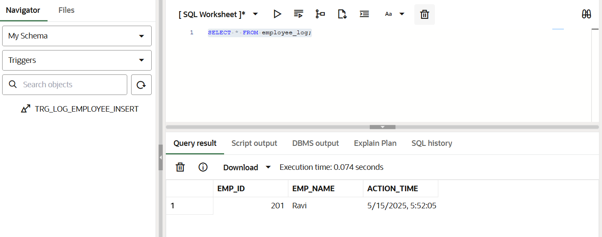
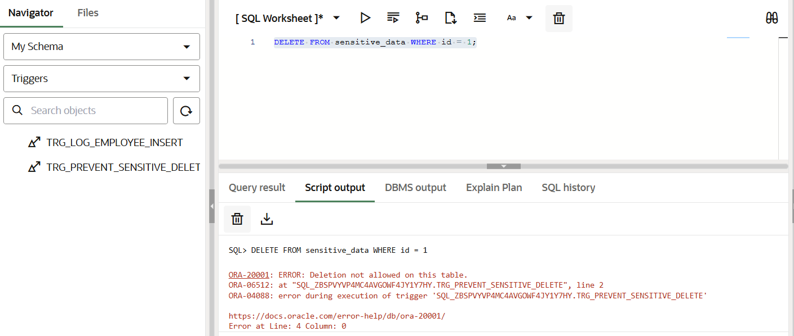
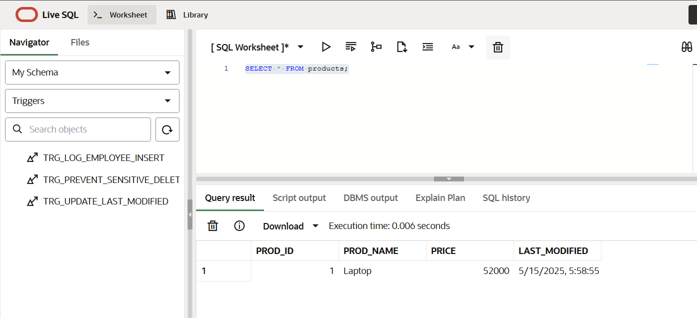
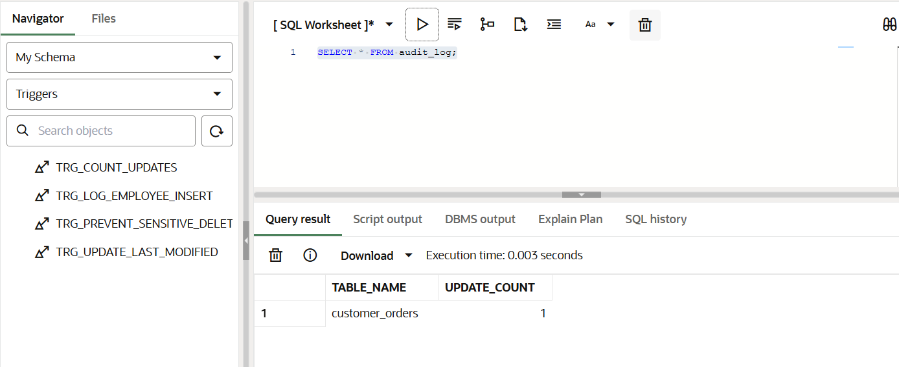
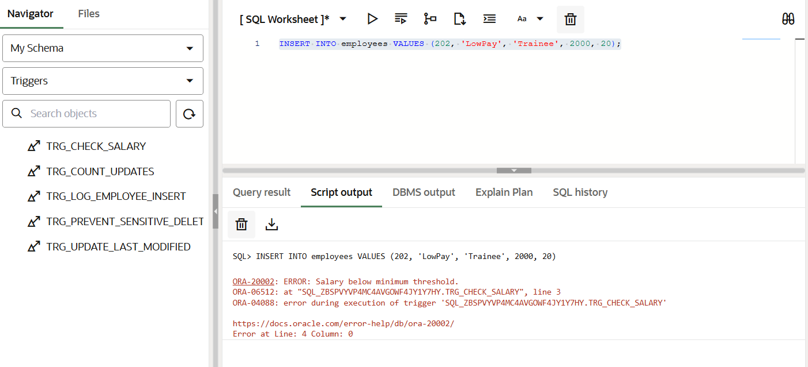
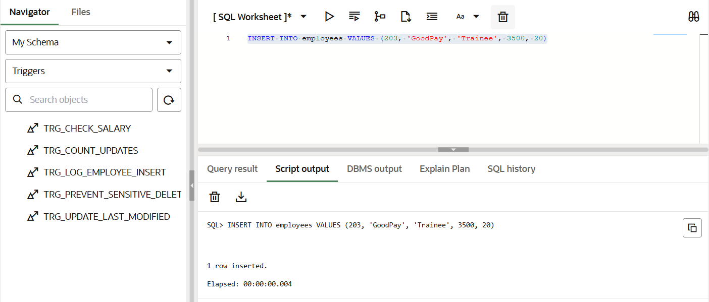

# Experiment 10: PL/SQL – Triggers

## AIM
To write and execute PL/SQL trigger programs for automating actions in response to specific table events like INSERT, UPDATE, or DELETE.

---

## THEORY

A **trigger** is a stored PL/SQL block that is automatically executed or fired when a specified event occurs on a table or view. Triggers can be used for enforcing business rules, auditing changes, or automatic updates.

### Types of Triggers:
- **Before Trigger**: Executes before the operation (INSERT, UPDATE, DELETE).
- **After Trigger**: Executes after the operation.
- **Row-level Trigger**: Executes for each affected row.
- **Statement-level Trigger**: Executes once for the triggering statement.

**Basic Syntax:**
```sql
CREATE OR REPLACE TRIGGER trigger_name
BEFORE|AFTER INSERT|UPDATE|DELETE ON table_name
[FOR EACH ROW]
BEGIN
   -- trigger logic
END;
```

## 1. Write a trigger to log every insertion into a table.
**Steps:**
- Create two tables: `employees` (for storing data) and `employee_log` (for logging the inserts).
- Write an **AFTER INSERT** trigger on the `employees` table to log the new data into the `employee_log` table.

### Program:
```
CREATE OR REPLACE TRIGGER trg_log_employee_insert
AFTER INSERT ON employees
FOR EACH ROW
BEGIN
   INSERT INTO employee_log (emp_id, emp_name, action_time)
   VALUES (:NEW.emp_id, :NEW.emp_name, SYSDATE);
END;
```
```
CREATE TABLE employee_log (
   emp_id     NUMBER,
   emp_name   VARCHAR2(50),
   action_time DATE
);
```
```
CREATE OR REPLACE TRIGGER trg_log_employee_insert
AFTER INSERT ON employees
FOR EACH ROW
BEGIN
   INSERT INTO employee_log (emp_id, emp_name, action_time)
   VALUES (:NEW.emp_id, :NEW.emp_name, SYSDATE);
END;
```
```
INSERT INTO employees VALUES (201, 'Ravi', 'Intern', 3500, 40);
```
```
SELECT * FROM employee_log;
```


**Expected Output:**
- A new entry is added to the `employee_log` table each time a new record is inserted into the `employees` table.



---

## 2. Write a trigger to prevent deletion of records from a sensitive table.
**Steps:**
- Write a **BEFORE DELETE** trigger on the `sensitive_data` table.
- Use `RAISE_APPLICATION_ERROR` to prevent deletion and issue a custom error message.

### Program:
```
CREATE TABLE sensitive_data (
   id   NUMBER,
   info VARCHAR2(100)
);
```
```
CREATE OR REPLACE TRIGGER trg_prevent_sensitive_delete
BEFORE DELETE ON sensitive_data
BEGIN
   RAISE_APPLICATION_ERROR(-20001, 'ERROR: Deletion not allowed on this table.');
END;
```
```
INSERT INTO sensitive_data VALUES (1, 'Top Secret');
```
```
DELETE FROM sensitive_data WHERE id = 1;
```

**Expected Output:**
- If an attempt is made to delete a record from `sensitive_data`, an error message is raised, e.g., `ERROR: Deletion not allowed on this table.`



---

## 3. Write a trigger to automatically update a `last_modified` timestamp.
**Steps:**
- Add a `last_modified` column to the `products` table.
- Write a **BEFORE UPDATE** trigger on the `products` table to set the `last_modified` column to the current timestamp whenever an update occurs.

### Program:
```
CREATE TABLE products (
   prod_id        NUMBER,
   prod_name      VARCHAR2(50),
   price          NUMBER,
   last_modified  DATE
);
```
```
CREATE OR REPLACE TRIGGER trg_update_last_modified
BEFORE UPDATE ON products
FOR EACH ROW
BEGIN
   :NEW.last_modified := SYSDATE;
END;
```
```
INSERT INTO products VALUES (1, 'Laptop', 50000, NULL);
```
```
UPDATE products SET price = 52000 WHERE prod_id = 1;
```
```
SELECT * FROM products;
```

**Expected Output:**
- The `last_modified` column in the `products` table is updated automatically to the current date and time when any record is updated.



---

## 4. Write a trigger to keep track of the number of updates made to a table.
**Steps:**
- Create an `audit_log` table with a counter column.
- Write an **AFTER UPDATE** trigger on the `customer_orders` table to increment the counter in the `audit_log` table every time a record is updated.

### Program:
```
CREATE TABLE audit_log (
   table_name VARCHAR2(50),
   update_count NUMBER
);
```
```
INSERT INTO audit_log VALUES ('customer_orders', 0);
```
```
CREATE TABLE customer_orders (
   order_id   NUMBER,
   cust_name  VARCHAR2(50),
   amount     NUMBER
);
```
```
CREATE OR REPLACE TRIGGER trg_count_updates
AFTER UPDATE ON customer_orders
FOR EACH ROW
BEGIN
   UPDATE audit_log
   SET update_count = update_count + 1
   WHERE table_name = 'customer_orders';
END;
```
```
INSERT INTO customer_orders VALUES (1, 'Arun', 3000);
```
```
UPDATE customer_orders SET amount = 3200 WHERE order_id = 1;
```
```
SELECT * FROM audit_log;
```

**Expected Output:**
- The `audit_log` table will maintain a count of how many updates have been made to the `customer_orders` table.



---

## 5. Write a trigger that checks a condition before allowing insertion into a table.
**Steps:**
- Write a **BEFORE INSERT** trigger on the `employees` table to check if the inserted salary meets a specific condition (e.g., salary must be greater than 3000).
- If the condition is not met, raise an error to prevent the insert.

### Program:
```
CREATE OR REPLACE TRIGGER trg_check_salary
BEFORE INSERT ON employees
FOR EACH ROW
BEGIN
   IF :NEW.salary < 3000 THEN
      RAISE_APPLICATION_ERROR(-20002, 'ERROR: Salary below minimum threshold.');
   END IF;
END;
```
```
INSERT INTO employees VALUES (202, 'LowPay', 'Trainee', 2000, 20);
```
```
INSERT INTO employees VALUES (203, 'GoodPay', 'Trainee', 3500, 20)
```

**Expected Output:**
- If the inserted salary in the `employees` table is below the condition (e.g., salary < 3000), the insert operation is blocked, and an error message is raised, such as: `ERROR: Salary below minimum threshold.`





---

## RESULT
Thus, the PL/SQL trigger programs were written and executed successfully.
