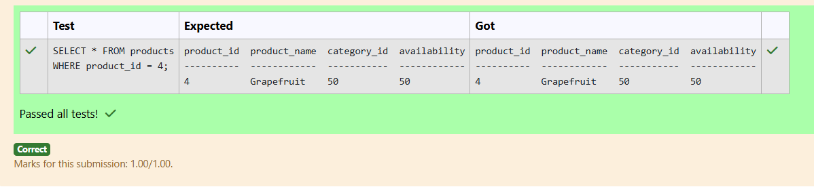
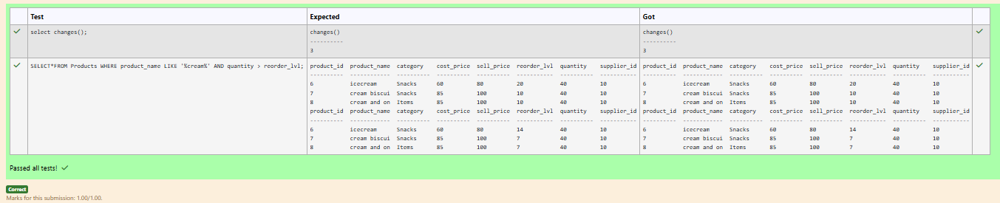
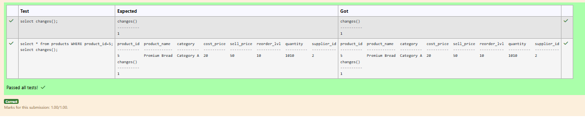
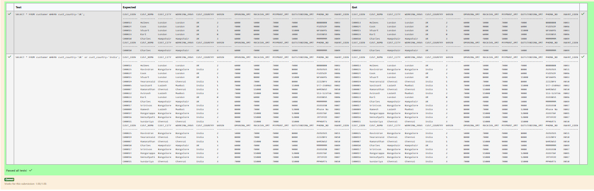

# Experiment 3: DML Commands

## AIM
To study and implement DML (Data Manipulation Language) commands.

## THEORY

### 1. INSERT INTO
Used to add records into a relation.
These are three type of INSERT INTO queries which are as
A)Inserting a single record
**Syntax (Single Row):**
```sql
INSERT INTO table_name (field_1, field_2, ...) VALUES (value_1, value_2, ...);
```
**Syntax (Multiple Rows):**
```sql
INSERT INTO table_name (field_1, field_2, ...) VALUES
(value_1, value_2, ...),
(value_3, value_4, ...);
```
**Syntax (Insert from another table):**
```sql
INSERT INTO table_name SELECT * FROM other_table WHERE condition;
```
### 2. UPDATE
Used to modify records in a relation.
Syntax:
```sql
UPDATE table_name SET column1 = value1, column2 = value2 WHERE condition;
```
### 3. DELETE
Used to delete records from a relation.
**Syntax (All rows):**
```sql
DELETE FROM table_name;
```
**Syntax (Specific condition):**
```sql
DELETE FROM table_name WHERE condition;
```
### 4. SELECT
Used to retrieve records from a table.
**Syntax:**
```sql
SELECT column1, column2 FROM table_name WHERE condition;
```
**Question 1**

Write a SQL statement to update the product_name as 'Grapefruit' whose product_id is 4 in the products table.

products table

---------------
product_id
product_name
category_id
availability

#### Code:
```
UPDATE products
SET product_name='Grapefruit'
WHERE product_id=4
```

**Output:**


**Question 2**

Write a SQL statement to change the email column of employees table with 'Unavailable' for all employees in employees table.

Employees table

---------------
employee_id
first_name
last_name
email
phone_number
hire_date
job_id
salary
commission_pct
manager_id
department_id
 

For example:

##### Test	
SELECT EMPLOYEE_ID,FIRST_NAME,EMAIL FROM EMPLOYEES LIMIT 2;
##### Result
EMPLOYEE_ID  FIRST_NAME  EMAIL
-----------  ----------  -----------
100          Steven      Unavailable
101          Neena       Unavailable

#### Code:
```
UPDATE EMPLOYEES
SET email='Unavailable';
```

**Output:**


**Question 3**

Decrease the reorder level by 30 percent where the product name contains 'cream' and quantity in stock is higher than reorder level in the products table.

PRODUCTS TABLE

name               type
-----------------  ---------------
product_id         INT
product_name       VARCHAR(100)
category           VARCHAR(50)
cost_price         DECIMAL(10,2)
sell_price         DECIMAL(10,2)
reorder_lvl        INT
quantity           INT
supplier_id        INT
 

For example:

##### Test	
select changes();
##### Result
changes()
----------
3

#### Code:
```
UPDATE products
SET reorder_lvl=reorder_lvl*0.7
WHERE product_name LIKE '%cream%'
AND quantity>reorder_lvl;
```

**Output:**


**Question 4**

Write a SQL statement to Update the product_name to 'Premium Bread' whose product ID is 5 in the products table.

Products table

---------------
product_id
product_name
category
cost_price
sell_price
reorder_lvl
quantity
supplier_id

#### Code:
```
UPDATE Products 
SET product_name='Premium Bread'
WHERE product_id=5;
```

**Output:**


**Question 5**

Write a SQL statement to increase the salary of employees under the department 40, 90 and 110 according to the company rules.

Salary will be increased by 25% for the department 40, 15% for department 90 and 10% for the department 110 and the rest of the departments will remain same.

Employees table

---------------
employee_id
first_name
last_name
email
phone_number
hire_date
job_id
salary
commission_pct
manager_id
department_id
For example:

##### Test	
SELECT EMPLOYEE_ID, FIRST_NAME, SALARY, PHONE_NUMBER, EMAIL, JOB_ID FROM EMPLOYEES LIMIT 10;
##### Result
EMPLOYEE_ID  FIRST_NAME  SALARY      PHONE_NUMBER  EMAIL       JOB_ID
-----------  ----------  ----------  ------------  ----------  ----------
100          Steven      27600       515.123.4567  SKING       AD_PRES
101          Neena       19550       515.123.4568  NKOCHHAR    AD_VP
102          Lex         19550       515.123.4569  LDEHAAN     AD_VP
103          Alexander   9000        590.423.4567  AHUNOLD     IT_PROG
104          Bruce       6000        590.423.4568  BERNST      IT_PROG
105          David       4800        590.423.4569  DAUSTIN     IT_PROG
106          Valli       4800        590.423.4560  VPATABAL    IT_PROG
107          Diana       4200        590.423.5567  DLORENTZ    IT_PROG
108          Nancy       12000       515.124.4569  NGREENBE    FI_MGR
109          Daniel      9000        515.124.4169  DFAVIET     FI_ACCOUNT

#### Code:
```
UPDATE Employees 
SET salary=CASE
    WHEN department_id=40 THEN ROUND(salary*1.25,0)
    WHEN department_id=90 THEN ROUND(salary*1.15,0)
    WHEN department_id=110 THEN ROUND(salary*1.1,0)
    ELSE salary
END;
```

**Output:**


**Question 6**

Write a SQL query to Delete customers from 'customer' table where 'CUST_COUNTRY' is neither 'India' nor 'USA'.

Sample table: Customer

+-----------+-------------+-------------+--------------+--------------+-------+-------------+-------------+-------------+---------------+--------------+------------+  
|CUST_CODE  | CUST_NAME   | CUST_CITY   | WORKING_AREA | CUST_COUNTRY | GRADE | OPENING_AMT | RECEIVE_AMT | PAYMENT_AMT |OUTSTANDING_AMT| PHONE_NO     | AGENT_CODE |
+-----------+-------------+-------------+--------------+--------------+-------+-------------+-------------+-------------+---------------+--------------+------------+
| C00013    | Holmes      | London      | London       | UK           |     2 |     6000.00 |     5000.00 |     7000.00 |       4000.00 | BBBBBBB      | A003       |
| C00001    | Micheal     | New York    | New York     | USA          |     2 |     3000.00 |     5000.00 |     2000.00 |       6000.00 | CCCCCCC      | A008       |
| C00020    | Albert      | New York    | New York     | USA          |     3 |     5000.00 |     7000.00 |     6000.00 |       6000.00 | BBBBSBB      | A008       |
For example:

##### Test	
select changes();
##### Result
changes()
----------
11

#### Code:
```
DELETE FROM Customer
WHERE CUST_COUNTRY NOT IN('India','USA')
```

**Output:**


**Question 7**

Write a SQL query to remove rows from the table 'customer' with the following condition -

1. 'cust_city' should begin with the letter 'L',

Sample table: Customer

+-----------+-------------+-------------+--------------+--------------+-------+-------------+-------------+-------------+---------------+--------------+------------+  
|CUST_CODE  | CUST_NAME   | CUST_CITY   | WORKING_AREA | CUST_COUNTRY | GRADE | OPENING_AMT | RECEIVE_AMT | PAYMENT_AMT |OUTSTANDING_AMT| PHONE_NO     | AGENT_CODE |
+-----------+-------------+-------------+--------------+--------------+-------+-------------+-------------+-------------+---------------+--------------+------------+
| C00013    | Holmes      | London      | London       | UK           |     2 |     6000.00 |     5000.00 |     7000.00 |       4000.00 | BBBBBBB      | A003       |
| C00001    | Micheal     | New York    | New York     | USA          |     2 |     3000.00 |     5000.00 |     2000.00 |       6000.00 | CCCCCCC      | A008       |
| C00020    | Albert      | New York    | New York     | USA          |     3 |     5000.00 |     7000.00 |     6000.00 |       6000.00 | BBBBSBB      | A008       |
For example:

##### Test	
SELECT * FROM customer WHERE cust_country='UK';
##### Result
CUST_CODE   CUST_NAME   CUST_CITY   WORKING_AREA  CUST_COUNTRY  GRADE       OPENING_AMT  RECEIVE_AMT  PAYMENT_AMT  OUTSTANDING_AMT  PHONE_NO    AGENT_CODE
----------  ----------  ----------  ------------  ------------  ----------  -----------  -----------  -----------  ---------------  ----------  ----------
C00013      Holmes      London      London        UK            2           6000         5000         7000         4000             BBBBBBB     A003
C00024      Cook        London      London        UK            2           4000         9000         7000         6000             FSDDSDF     A006
C00015      Stuart      London      London        UK            1           6000         8000         3000         11000            GFSGERS     A003
C00023      Karl        London      London        UK            0           4000         6000         7000         3000             AAAABAA     A006
C00010      Charles     Hampshair   Hampshair     UK            3           6000         4000         5000         5000             MMMMMMM     A009
CUST_CODE   CUST_NAME   CUST_CITY   WORKING_AREA  CUST_COUNTRY  GRADE       OPENING_AMT  RECEIVE_AMT  PAYMENT_AMT  OUTSTANDING_AMT  PHONE_NO    AGENT_CODE
----------  ----------  ----------  ------------  ------------  ----------  -----------  -----------  -----------  ---------------  ----------  ----------
C00010      Charles     Hampshair   Hampshair     UK            3           6000         4000         5000         5000             MMMMMMM     A009

#### Code:
```
DELETE FROM Customer
WHERE CUST_CITY LIKE 'L%';
```

**Output:**


**Question 8**

Write a SQL query to Delete customers with 'GRADE' 3 or 'AGENT_CODE' 'A008' whose 'OUTSTANDING_AMT' is less than 5000

Sample table: Customer

+-----------+-------------+-------------+--------------+--------------+-------+-------------+-------------+-------------+---------------+--------------+------------+  
|CUST_CODE  | CUST_NAME   | CUST_CITY   | WORKING_AREA | CUST_COUNTRY | GRADE | OPENING_AMT | RECEIVE_AMT | PAYMENT_AMT |OUTSTANDING_AMT| PHONE_NO     | AGENT_CODE |
+-----------+-------------+-------------+--------------+--------------+-------+-------------+-------------+-------------+---------------+--------------+------------+
| C00013    | Holmes      | London      | London       | UK           |     2 |     6000.00 |     5000.00 |     7000.00 |       4000.00 | BBBBBBB      | A003       |
| C00001    | Micheal     | New York    | New York     | USA          |     2 |     3000.00 |     5000.00 |     2000.00 |       6000.00 | CCCCCCC      | A008       |
| C00020    | Albert      | New York    | New York     | USA          |     3 |     5000.00 |     7000.00 |     6000.00 |       6000.00 | BBBBSBB      | A008       |
For example:

##### Test	
select changes();
##### Result
changes()
----------
1

#### Code:
```
DELETE FROM Customer
WHERE (GRADE=3 OR AGENT_CODE='A008') AND OUTSTANDING_AMT<5000
```

**Output:**


**Question 9**

Write a SQL query to Delete all Doctors whose Specialization is either 'Pediatrics' or 'Cardiology' and Last Name is Brown.

Sample table: Doctors

attributes : doctor_id, first_name, last_name, specialization
For example:

##### Test	
SELECT * FROM doctors;
##### Result
doctor_id   first_name  last_name   specialization
----------  ----------  ----------  --------------
1           John        Smith       Cardiology
2           Emily       Johnson     Orthopedics
3           Michael     Brown       Pediatrics
doctor_id   first_name  last_name   specialization
----------  ----------  ----------  --------------
1           John        Smith       Cardiology
2           Emily       Johnson     Orthopedics

#### Code:
```
DELETE FROM Doctors
WHERE specialization IN ('Pediatrics','Cardiology') AND last_name='Brown'
```

**Output:**


**Question 10**

Write a SQL query to Delete customers whose 'GRADE' is greater than 2 and have a 'PAYMENT_AMT' less than the average 'PAYMENT_AMT' for all customers, or whose 'OUTSTANDING_AMT' is greater than 8000:

Sample table: Customer

+-----------+-------------+-------------+--------------+--------------+-------+-------------+-------------+-------------+---------------+--------------+------------+  
|CUST_CODE  | CUST_NAME   | CUST_CITY   | WORKING_AREA | CUST_COUNTRY | GRADE | OPENING_AMT | RECEIVE_AMT | PAYMENT_AMT |OUTSTANDING_AMT| PHONE_NO     | AGENT_CODE |
+-----------+-------------+-------------+--------------+--------------+-------+-------------+-------------+-------------+---------------+--------------+------------+
| C00013    | Holmes      | London      | London       | UK           |     2 |     6000.00 |     5000.00 |     7000.00 |       4000.00 | BBBBBBB      | A003       |
| C00001    | Micheal     | New York    | New York     | USA          |     2 |     3000.00 |     5000.00 |     2000.00 |       6000.00 | CCCCCCC      | A008       |
| C00020    | Albert      | New York    | New York     | USA          |     3 |     5000.00 |     7000.00 |     6000.00 |       6000.00 | BBBBSBB      | A008       |
For example:

##### Test	
select changes();
##### Result
changes()
----------
12

#### Code:
```
DELETE FROM Customer
WHERE (GRADE>2 AND PAYMENT_AMT<(SELECT AVG(PAYMENT_AMT) FROM Customer)) OR OUTSTANDING_AMT>8000;
```

**Output:**


## RESULT
Thus, the SQL queries to implement DML commands have been executed successfully.

### Module 2 Result:
