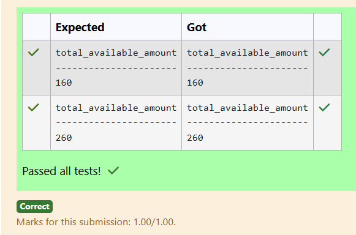
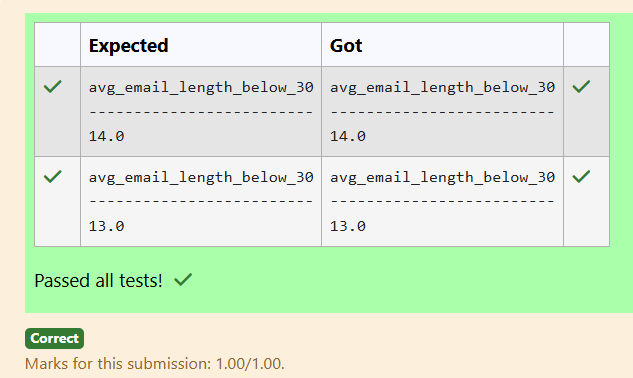
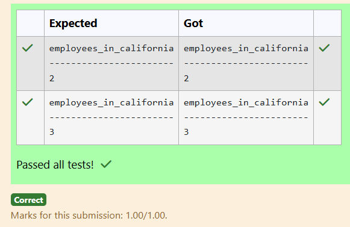

# Experiment 4: Aggregate Functions, Group By and Having Clause

## AIM
To study and implement aggregate functions, GROUP BY, and HAVING clause with suitable examples.

## THEORY

### Aggregate Functions
These perform calculations on a set of values and return a single value.

- **MIN()** – Smallest value  
- **MAX()** – Largest value  
- **COUNT()** – Number of rows  
- **SUM()** – Total of values  
- **AVG()** – Average of values

**Syntax:**
```sql
SELECT AGG_FUNC(column_name) FROM table_name WHERE condition;
```
### GROUP BY
Groups records with the same values in specified columns.
**Syntax:**
```sql
SELECT column_name, AGG_FUNC(column_name)
FROM table_name
GROUP BY column_name;
```
### HAVING
Filters the grouped records based on aggregate conditions.
**Syntax:**
```sql
SELECT column_name, AGG_FUNC(column_name)
FROM table_name
GROUP BY column_name
HAVING condition;
```

**Question 1**

How many appointments are scheduled for each doctor?

Sample table:Appointments Table


For example:

##### Result
DoctorID    TotalAppointments
----------  -----------------
3           3
4           2
6           1
7           3
10          1

#### Code:
```
SELECT DoctorID, COUNT(*) AS TotalAppointments
FROM Appointments 
GROUP BY DoctorID;
```

**Output:**


**Question 2**

How many medical records does each doctor have?

Sample table:MedicalRecords Table


For example:

##### Result

DoctorID    TotalRecords
----------  ------------
3           4
5           1
6           1
7           1
8           3

#### Code:
```
SELECT DoctorID, COUNT(*) AS TotalRecords
FROM MedicalRecords 
GROUP BY DoctorID;
```

**Output:**


**Question 3**

How many doctors specialize in each medical specialty?

Sample table:Doctors Table


For example:

##### Result
Specialty          TotalDocto
-----------------  ----------
Gastroenterology   1
Neurology          1
Obstetrics         3
Ophthalmology      1
Orthopedics        1
Pediatrics         2
Urology            1

#### Code:
```
SELECT Specialty, COUNT(*) AS TotalDocto
FROM Doctors 
GROUP BY Specialty;
```

**Output:**


**Question 4**

Write a SQL query to calculate total available amount of fruits that has a price greater than 0.5 . Return total Count. 

Note: Inventory attribute contains amount of fruits

Table: fruits

name        type
----------  ----------
id          INTEGER
name        TEXT
unit        TEXT
inventory   INTEGER
price       REAL
 

For example:

##### Result
total_available_amount
----------------------
160

#### Code:
```
SELECT SUM(inventory) AS total_available_amount
FROM fruits
WHERE price>0.5;
```


**Output:**



**Question 5**

Write a SQL query to Calculate the average email length (in characters) for people who lives in Mumbai city

Table: customer

name        type
----------  ----------
id          INTEGER
name        TEXT   
city        TEXT
email       TEXT
phone       INTEGER
For example:

##### Result
avg_email_length_below_30
-------------------------
14.0

#### Code:
```
SELECT AVG(LENGTH(email)) AS avg_email_length_below_30
FROM customer
WHERE city='Mumbai';
```

**Output:**


**Question 6**
Write a SQL query to find the average length of email addresses (in characters):

Table: customer

name        type
----------  ----------
id          INTEGER
name        TEXT
city        TEXT
email       TEXT
phone       INTEGER
For example:

##### Result
avg_email_length
----------------
15.0

#### Code:
```
SELECT AVG(LENGTH(email)) AS avg_email_length
FROM customer;
```

**Output:**


**Question 7**

Write a SQL query to find  how many employees work in California?

Table: employee

name        type
----------  ----------
id          INTEGER
name        TEXT
age         INTEGER
city        TEXT
income      INTEGER
 

For example:

##### Result
employees_in_california
-----------------------
2

#### Code:
```
SELECT COUNT(*) AS employees_in_california
FROM employee
WHERE city='California';
```

**Output:**


**Question 8**

Write a SQL query to identify the cities (addresses) where the average salary is greater than Rs. 5000, as per the "customer1" table.

Sample table: customer1


For example:

##### Result
address     AVG(salary)
----------  -----------
Bhopal      8500.0
Indore      10000.0
Mumbai      6500.0

#### Code:
```
SELECT address, AVG(salary)
FROM customer1
GROUP BY address
HAVING AVG(salary)>5000;
```

**Output:**


**Question 9**

Write the SQL query that accomplishes the grouping of data by age, calculates the average income for each age group, and includes only those age groups where the average income falls between 300,000 and 500,000.

Sample table: employee


For example:

##### Result
age         AVG(income)
----------  -----------
45          450000.0

#### Code:
```
SELECT age, AVG(income)
FROM employee
GROUP BY age
HAVING AVG(income) BETWEEN 300000 AND 500000;
```

**Output:**


**Question 10**

Write the SQL query that achieves the selection of product names and the maximum price for each category from the "products" table, and includes only those products where the maximum price is greater than 15.

Sample table: products


For example:

##### Result
category_id  product_name  Price
-----------  ------------  ----------
1            Orange        15.5
2            Monitor       25

#### Code:
```
SELECT category_id, product_name, MAX(price) AS Price
FROM products
GROUP BY category_id
HAVING MAX(price)>15;
```

**Output:**


## RESULT
Thus, the SQL queries to implement aggregate functions, GROUP BY, and HAVING clause have been executed successfully.

### Module 3 Result:

