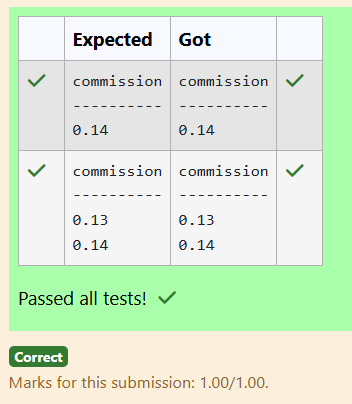
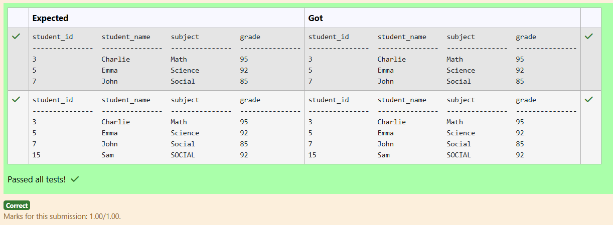

# Experiment 5: Subqueries and Views

## AIM
To study and implement subqueries and views.

## THEORY

### Subqueries
A subquery is a query inside another SQL query and is embedded in:
- WHERE clause
- HAVING clause
- FROM clause

**Types:**
- **Single-row subquery**:
  Sub queries can also return more than one value. Such results should be made use along with the operators in and any.
- **Multiple-row subquery**:
  Here more than one subquery is used. These multiple sub queries are combined by means of ‘and’ & ‘or’ keywords.
- **Correlated subquery**:
  A subquery is evaluated once for the entire parent statement whereas a correlated Sub query is evaluated once per row processed by the parent statement.

**Example:**
```sql
SELECT * FROM employees
WHERE salary > (SELECT AVG(salary) FROM employees);
```
### Views
A view is a virtual table based on the result of an SQL SELECT query.
**Create View:**
```sql
CREATE VIEW view_name AS
SELECT column1, column2 FROM table_name WHERE condition;
```
**Drop View:**
```sql
DROP VIEW view_name;
```

**Question 1**

Write a SQL query to Find employees who have an age less than the average age of employees with incomes over 2.5 Lakh

Employee Table

name             type

------------   ---------------

id                    INTEGER

name              TEXT

age                 INTEGER

city                 TEXT

income           INTEGER

For example:

#### Result
id     name             age              city             income
-----  ---------------  ---------------  ---------------  ----------
101    Peter            32               NewYork          200000
102    Mark             32               California       300000
103    Donald           25               Arizona          1000000
104    Obama            35               Florida          5000000
105    Linklon          32               Georgia          250000
107    Adam             35               California       5000000

#### Code:
```
SELECT id, name, age, city, income
FROM Employee
WHERE age < (
    SELECT AVG(age)
    FROM Employee
    WHERE income > 250000
);
```


**Output:**


**Question 2**

From the following tables, write a SQL query to find all the orders generated in New York city. Return ord_no, purch_amt, ord_date, customer_id and salesman_id.

SALESMAN TABLE

name               type
-----------        ----------
salesman_id  numeric(5)
name             varchar(30)
city                 varchar(15)
commission   decimal(5,2)

ORDERS TABLE

name            type
----------      ----------
ord_no          int
purch_amt    real
ord_date       text
customer_id  int
salesman_id  int

For example:

#### Result
ord_no      purch_amt   ord_date    customer_id  salesman_id
----------  ----------  ----------  -----------  -----------
70002       65.26       2012-10-05  3002         5001
70005       2400.6      2012-07-27  3007         5001
70008       5760.0      2012-09-10  3002         5001
70013       3045.6      2012-04-25  3002         5001

#### Code:
```
SELECT ord_no,purch_amt,ord_date,customer_id,salesman_id
FROM ORDERS 
WHERE salesman_id IN(
    SELECT salesman_id
    FROM SALESMAN 
    WHERE city='New York'
);
```

**Output:**


**Question 3**

Write a SQL query to Identify customers whose city is different from the city of the customer with the highest ID

SAMPLE TABLE: customer

name             type
---------------  ---------------
id               INTEGER
name             TEXT
city             TEXT
email            TEXT
phone            INTEGER
For example:

#### Result
id     name             city             email            phone
-----  ---------------  ---------------  ---------------  ----------
6      Aarti Desai      Pune             aarti@gmail.com  890123456
7      Vivek Sharma     Chandigarh       vivek@gmail.com  980154021
8      Nisha Patel      Noida            nisha@gmail.com  901234567
9      Rajesh Singh     Hyderabad        rajesh@gmail.co  917654301


#### Code:
```
SELECT id,name,city,email,phone
FROM customer
WHERE city <> (
    SELECT city
    FROM customer
    WHERE id = (SELECT MAX(id) FROM customer)
);
```

**Output:**


**Question 4**

Write a SQL query to retrieve all columns from the CUSTOMERS table for customers whose salary is EQUAL TO $1500.

Sample table: CUSTOMERS

ID          NAME        AGE         ADDRESS     SALARY
----------  ----------  ----------  ----------  ----------

1          Ramesh     32              Ahmedabad     2000
2          Khilan        25              Delhi                 1500
3          Kaushik      23              Kota                  2000
4          Chaitali       25             Mumbai            6500
5          Hardik        27              Bhopal              8500
6          Komal         22              Hyderabad       4500

7           Muffy          24              Indore            10000

 
 

For example:

#### Result
ID          NAME        AGE         ADDRESS     SALARY
----------  ----------  ----------  ----------  ----------
2           Khilan      25          Delhi       1500

#### Code:
```
SELECT *
FROM CUSTOMERS
WHERE SALARY=1500;
```

**Output:**


**Question 5**

Write a SQL query to Retrieve the names of customers who have a phone number that is not shared with any other customer.

SAMPLE TABLE: customer

name             type
---------------  ---------------
id               INTEGER
name             TEXT
city             TEXT
email            TEXT
phone            INTEGER
For example:

#### Result
name
---------------
Aarti Desai
Vivek Sharma
Nisha Patel
Rajesh Singh
Radha Iyer

#### Code:
```
SELECT name
FROM customer
WHERE phone IN(
    SELECT phone 
    FROM customer
    GROUP BY phone
    HAVING COUNT(*)=1
);
```

**Output:**


**Question 6**

From the following tables, write a SQL query to determine the commission of the salespeople in Paris. Return commission.

salesman table

name             type
---------------  ---------------
salesman_id      numeric(5)
name                 varchar(30)
city                    varchar(15)
commission       decimal(5,2)

customer table

name         type
-----------  ----------
customer_id  int
cust_name    text
city         text
grade        int
salesman_id  int
For example:

#### Result
commission
----------
0.14

#### Code:
```
SELECT DISTINCT s.commission
FROM salesman s
WHERE s.salesman_id IN (
    SELECT salesman_id
    FROM customer
    WHERE city = 'Paris'
);
```

**Output:**



**Question 7**

Write a SQL query that retrieve all the columns from the table "Grades", where the grade is equal to the maximum grade achieved in each subject.

Sample table: GRADES (attributes: student_id, student_name, subject, grade)


For example:

#### Result
student_id       student_name     subject          grade
---------------  ---------------  ---------------  ---------------
3                Charlie          Math             95
5                Emma             Science          92
7                John             Social           85

#### Code:
```
SELECT student_id, student_name, subject, grade
FROM Grades g
WHERE grade = (
    SELECT MAX(grade)
    FROM Grades
    WHERE subject = g.subject
);
```

**Output:**



**Question 8**

Write a SQL query to retrieve all columns from the CUSTOMERS table for customers whose Address as Delhi and age below 30

Sample table: CUSTOMERS

ID          NAME        AGE         ADDRESS     SALARY
----------  ----------  ----------  ----------  ----------

1          Ramesh     32              Ahmedabad     2000
2          Khilan        25              Delhi                 1500
3          Kaushik      23              Kota                  2000
4          Chaitali       25             Mumbai            6500
5          Hardik        27              Bhopal              8500
6          Komal         22              Hyderabad       4500

7           Muffy          24              Indore            10000

 
 

For example:

#### Result
ID          NAME        AGE         ADDRESS     SALARY
----------  ----------  ----------  ----------  ----------
2           Khilan      25          Delhi       1500

#### Code:
```
SELECT *
FROM CUSTOMERS
WHERE ADDRESS='Delhi' AND AGE<30
ORDER BY ID;
```


**Output:**


**Question 9**

From the following tables write a SQL query to count the number of customers with grades above the average in New York City. Return grade and count.

customer table

name         type
-----------  ----------
customer_id  int
cust_name    text
city         text
grade        int
salesman_id  int
For example:

#### Result
grade       COUNT(*)
----------  ----------
300         2

#### Code:
```
From the following tables write a SQL query to count the number of customers with grades above the average in New York City. Return grade and count.

customer table

name         type
-----------  ----------
customer_id  int
cust_name    text
city         text
grade        int
salesman_id  int
For example:

Result
grade       COUNT(*)
----------  ----------
300         2
```


**Output:**


**Question 10**

Write a SQL query that retrieves the names of students and their corresponding grades, where the grade is equal to the minimum grade achieved in each subject.

Sample table: GRADES (attributes: student_id, student_name, subject, grade)


For example:

#### Result
student_name     grade
---------------  ---------------
Bob              85
Frank            85
John             85

#### Code:
```
SELECT student_name, grade
FROM GRADES g
WHERE grade = (
    SELECT MIN(grade)
    FROM GRADES
    WHERE subject = g.subject
)
ORDER BY grade;
```


**Output:**


## RESULT
Thus, the SQL queries to implement subqueries and views have been executed successfully.
