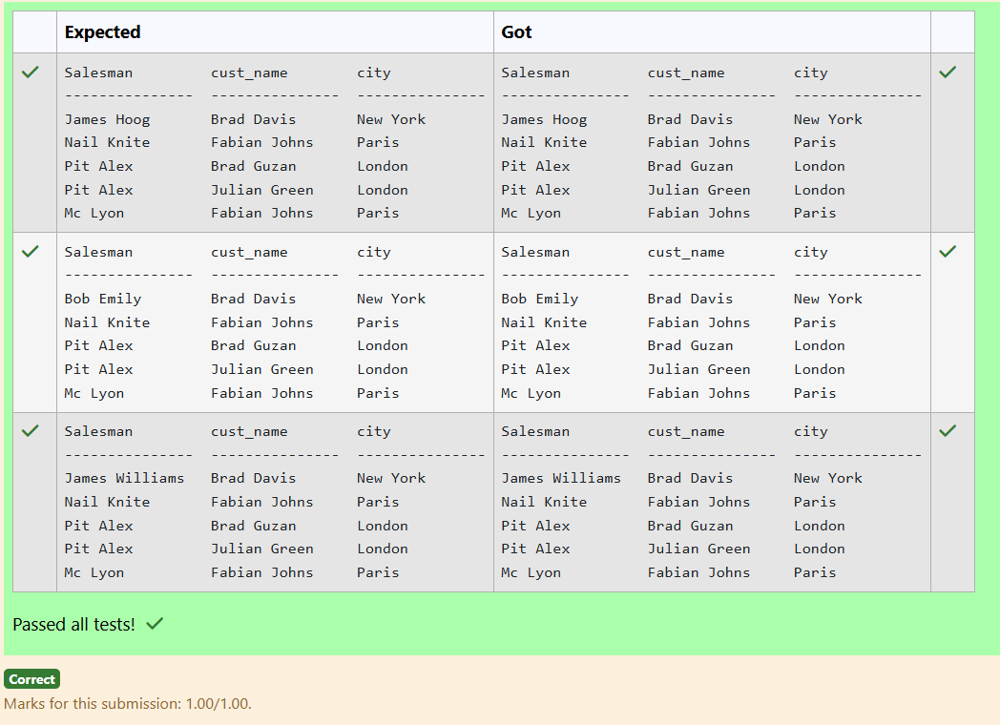
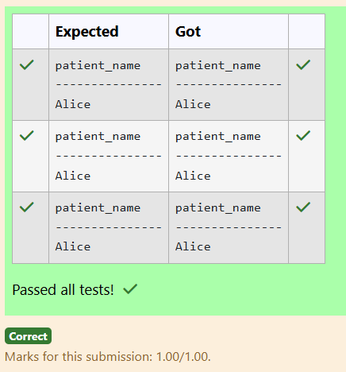
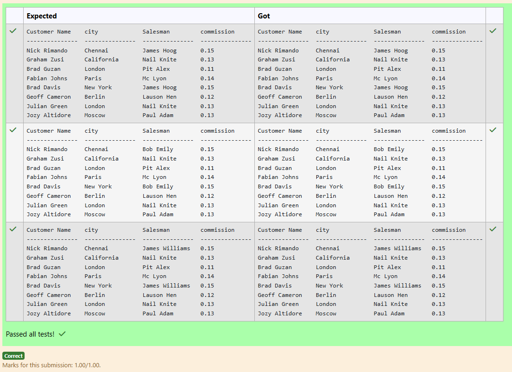
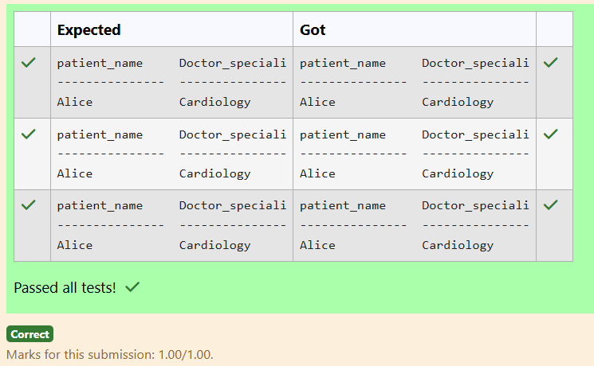
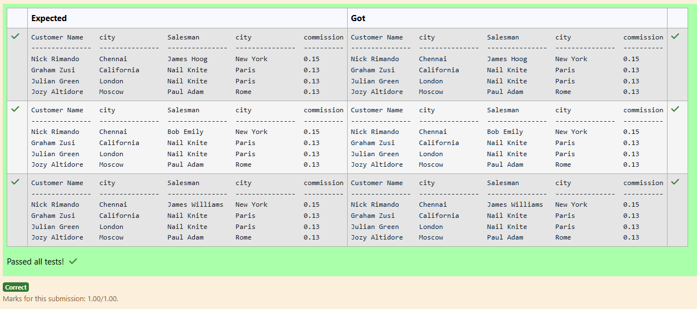
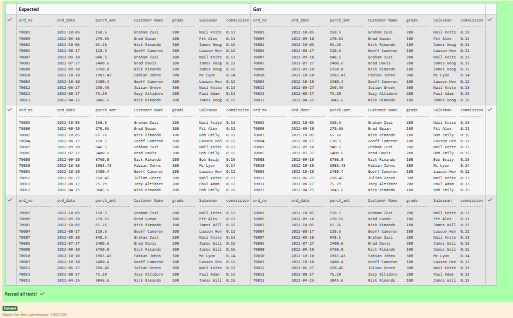

# Experiment 6: Joins

## AIM
To study and implement different types of joins.

## THEORY

SQL Joins are used to combine records from two or more tables based on a related column.

### 1. INNER JOIN
Returns records with matching values in both tables.

**Syntax:**
```sql
SELECT columns
FROM table1
INNER JOIN table2
ON table1.column = table2.column;
```

### 2. LEFT JOIN
Returns all records from the left table, and matched records from the right.

**Syntax:**

```sql
SELECT columns
FROM table1
LEFT JOIN table2
ON table1.column = table2.column;
```
### 3. RIGHT JOIN
Returns all records from the right table, and matched records from the left.

**Syntax:**

```sql
SELECT columns
FROM table1
RIGHT JOIN table2
ON table1.column = table2.column;
```
### 4. FULL OUTER JOIN
Returns all records when there is a match in either left or right table.

**Syntax:**

```sql
SELECT columns
FROM table1
FULL OUTER JOIN table2
ON table1.column = table2.column;
```

**Question 1**

Write the SQL query that achieves the selection of the "cust_name" column from the "customer" table (aliased as "c"), with a left join on the "customer_id" column.

CUSTOMER TABLE:


ORDERS TABLE:


For example:

#### Result
cust_name
---------------
Nick Rimando
Nick Rimando
Nick Rimando
Graham Zusi
Graham Zusi
Brad Guzan
Fabian Johns
Brad Davis
Geoff Cameron
Geoff Cameron
Julian Green
Jozy Altidore

#### Code:
```
SELECT c.cust_name
FROM customer AS c
LEFT JOIN orders AS o ON c.customer_id = o.customer_id;
```

**Output:**


**Question 2**

Write a SQL statement to join the tables salesman, customer and orders so that the same column of each table appears once and only the relational rows are returned. 

Sample table: orders

ord_no      purch_amt   ord_date    customer_id  salesman_id
----------  ----------  ----------  -----------  -----------
70001       150.5       2012-10-05  3005         5002
70009       270.65      2012-09-10  3001         5005
70002       65.26       2012-10-05  3002         5001
70004       110.5       2012-08-17  3009         5003
70007       948.5       2012-09-10  3005         5002
70005       2400.6      2012-07-27  3007         5001
70008       5760        2012-09-10  3002         5001
70010       1983.43     2012-10-10  3004         5006
70003       2480.4      2012-10-10  3009         5003
70012       250.45      2012-06-27  3008         5002
70011       75.29       2012-08-17  3003         5007
70013       3045.6      2012-04-25  3002         5001
Sample table: customer

 customer_id |   cust_name    |    city    | grade | salesman_id 
-------------+----------------+------------+-------+-------------
        3002 | Nick Rimando   | New York   |   100 |        5001
        3007 | Brad Davis     | New York   |   200 |        5001
        3005 | Graham Zusi    | California |   200 |        5002
        3008 | Julian Green   | London     |   300 |        5002
        3004 | Fabian Johnson | Paris      |   300 |        5006
        3009 | Geoff Cameron  | Berlin     |   100 |        5003
        3003 | Jozy Altidor   | Moscow     |   200 |        5007
        3001 | Brad Guzan     | London     |       |        5005
Sample table : salesman

 salesman_id |    name    |   city   | commission 
-------------+------------+----------+------------
        5001 | James Hoog | New York |       0.15
        5002 | Nail Knite | Paris    |       0.13
        5005 | Pit Alex   | London   |       0.11
        5006 | Mc Lyon    | Paris    |       0.14
        5007 | Paul Adam  | Rome     |       0.13
        5003 | Lauson Hen | San Jose |       0.12
For example:

#### Result
ord_no           purch_amt        ord_date         cust_name        customer_city  grade       salesman_name  salesman_city  commission
---------------  ---------------  ---------------  ---------------  -------------  ----------  -------------  -------------  ----------
70001            150.5            2012-10-05       Graham Zusi      California     200         Nail Knite     Paris          0.13
70009            270.65           2012-09-10       Brad Guzan       London         100         Pit Alex       London         0.11
70002            65.26            2012-10-05       Nick Rimando     Chennai        100         Bob Emily      New York       0.15
70004            110.5            2012-08-17       Geoff Cameron    Berlin         100         Lauson Hen     San Jose       0.12
70007            948.5            2012-09-10       Graham Zusi      California     200         Nail Knite     Paris          0.13
70005            2400.6           2012-07-27       Brad Davis       New York       200         Bob Emily      New York       0.15
70008            5760.0           2012-09-10       Nick Rimando     Chennai        100         Bob Emily      New York       0.15
70010            1983.43          2012-10-10       Fabian Johns     Paris          300         Mc Lyon        Paris          0.14
70003            2480.4           2012-10-10       Geoff Cameron    Berlin         100         Lauson Hen     San Jose       0.12
70012            250.45           2012-06-27       Julian Green     London         300         Nail Knite     Paris          0.13
70011            75.29            2012-08-17       Jozy Altidore    Moscow         200         Paul Adam      Rome           0.13
70013            3045.6           2012-04-25       Nick Rimando     Chennai        100         Bob Emily      New York       0.15

#### Code:
```
SELECT o.ord_no, o.purch_amt, o.ord_date, c.cust_name, c.city AS customer_city, c.grade, s.name AS salesman_name, s.city AS salesman_city, s.commission
FROM orders AS o
JOIN customer AS c ON o.customer_id = c.customer_id
JOIN salesman AS s ON o.salesman_id = s.salesman_id;
```


**Output:**


**Question 3**

write a SQL query to find the salesperson and customer who reside in the same city. Return Salesman, cust_name and city.

Sample table: salesman

 salesman_id |    name    |   city   | commission 
-------------+------------+----------+------------
        5001 | James Hoog | New York |       0.15
        5002 | Nail Knite | Paris    |       0.13
        5005 | Pit Alex   | London   |       0.11
        5006 | Mc Lyon    | Paris    |       0.14
        5007 | Paul Adam  | Rome     |       0.13
        5003 | Lauson Hen | San Jose |       0.12
Sample table: customer

 customer_id |   cust_name    |    city    | grade | salesman_id 
-------------+----------------+------------+-------+-------------
        3002 | Nick Rimando   | New York   |   100 |        5001
        3007 | Brad Davis     | New York   |   200 |        5001
        3005 | Graham Zusi    | California |   200 |        5002
        3008 | Julian Green   | London     |   300 |        5002
        3004 | Fabian Johnson | Paris      |   300 |        5006
        3009 | Geoff Cameron  | Berlin     |   100 |        5003
        3003 | Jozy Altidor   | Moscow     |   200 |        5007
        3001 | Brad Guzan     | London     |       |        5005
For example:

#### Result
Salesman         cust_name        city
---------------  ---------------  ---------------
Bob Emily        Brad Davis       New York
Nail Knite       Fabian Johns     Paris
Pit Alex         Brad Guzan       London
Pit Alex         Julian Green     London
Mc Lyon          Fabian Johns     Paris

#### Code:
```
SELECT s.name AS "Salesman", c.cust_name, c.city
FROM salesman s, customer c
WHERE s.city = c.city;
```

**Output:**



**Question 4**

Write the SQL query that achieves the selection of the first name from the "patients" table (aliased as "patient_name"), with an inner join on the "patient_id" column and a condition filtering for test results with the test name 'Blood Pressure'.

PATIENTS TABLE:

ATTRIBUTES - patient_id, first_name, last_name, date_of_birth, admission_date, discharge_date, doctor_id


TEST_RESULT TABLES:

ATTRIBUTES - result_id, patient_id, test_name, result, test_date


For example:

#### Result
patient_name
---------------
Alice

#### Code:
```
SELECT p.first_name AS patient_name
FROM patients p
INNER JOIN test_results t ON p.patient_id = t.patient_id
WHERE t.test_name = 'Blood Pressure';
```


**Output:**



**Question 5**

 From the following tables write a SQL query to find the salesperson(s) and the customer(s) he represents. Return Customer Name, city, Salesman, commission.

Sample table: customer

 customer_id |   cust_name    |    city    | grade | salesman_id 
-------------+----------------+------------+-------+-------------
        3002 | Nick Rimando   | New York   |   100 |        5001
        3007 | Brad Davis     | New York   |   200 |        5001
        3005 | Graham Zusi    | California |   200 |        5002
        3008 | Julian Green   | London     |   300 |        5002
        3004 | Fabian Johnson | Paris      |   300 |        5006
        3009 | Geoff Cameron  | Berlin     |   100 |        5003
        3003 | Jozy Altidor   | Moscow     |   200 |        5007
        3001 | Brad Guzan     | London     |       |        5005
Sample table: salesman

 salesman_id |    name    |   city   | commission 
-------------+------------+----------+------------
        5001 | James Hoog | New York |       0.15
        5002 | Nail Knite | Paris    |       0.13
        5005 | Pit Alex   | London   |       0.11
        5006 | Mc Lyon    | Paris    |       0.14
        5007 | Paul Adam  | Rome     |       0.13
        5003 | Lauson Hen | San Jose |       0.12
For example:

#### Result
Customer Name    city             Salesman         commission
---------------  ---------------  ---------------  ---------------
Nick Rimando     Chennai          Bob Emily        0.15
Graham Zusi      California       Nail Knite       0.13
Brad Guzan       London           Pit Alex         0.11
Fabian Johns     Paris            Mc Lyon          0.14
Brad Davis       New York         Bob Emily        0.15
Geoff Cameron    Berlin           Lauson Hen       0.12
Julian Green     London           Nail Knite       0.13
Jozy Altidore    Moscow           Paul Adam        0.

#### Code:
```
SELECT c.cust_name AS 'Customer Name', c.city, s.name AS Salesman, s.commission
FROM customer c
JOIN salesman s ON c.salesman_id=s.salesman_id;
```

**Output:**



**Question 6**

Write the SQL query that accomplishes the selection of all columns from the "patients" table and the first name of doctors from the "doctors" table, with an inner join on the "doctor_id" column.

PATIENTS TABLE:
name             type
---------------  ---------------
patient_id       INT
first_name       VARCHAR(50)
last_name        VARCHAR(50)
date_of_birth    DATE
admission_date   DATE
discharge_date   DATE
doctor_id        INT

DOCTORS TABLE:

name             type
---------------  ---------------
doctor_id        INT
first_name       VARCHAR(50)
last_name        VARCHAR(50)
specialization   VARCHAR(100)

For example:

#### Result
patient_id       first_name       last_name        date_of_birth    admission_date  discharge_date  doctor_id   doctor_name
---------------  ---------------  ---------------  ---------------  --------------  --------------  ----------  -----------
1                Alice            Williams         1980-05-12       2024-01-10                      1           John
2                Bob              Miller           1995-08-23       2024-02-15      2024-03-01      2           Emily
3                Charlie          Davis            1972-11-30       2024-03-10                      3           Michael

#### Code:
```
SELECT p.patient_id, p.first_name, p.last_name, p.date_of_birth, p.admission_date, p.discharge_date, 
       p.doctor_id, d.first_name AS doctor_name
FROM patients p
JOIN doctors d ON p.doctor_id = d.doctor_id;
```

**Output:**


**Question 7**

Write the SQL query that achieves the selection of the first name from the "patients" table (aliased as "patient_name") and the specialization from the "doctors" table (aliased as "Doctor_specialization"), with an inner join on the "doctor_id" column and a condition filtering for patients admitted between '2024-01-01' and '2024-01-31'.

PATIENTS TABLE:
name             type
---------------  ---------------
patient_id       INT
first_name       VARCHAR(50)
last_name        VARCHAR(50)
date_of_birth    DATE
admission_date   DATE
discharge_date   DATE
doctor_id        INT

DOCTORS TABLE:

name             type
---------------  ---------------
doctor_id        INT
first_name       VARCHAR(50)
last_name        VARCHAR(50)
specialization   VARCHAR(100)

For example:

#### Result
patient_name     Doctor_speciali
---------------  ---------------
Alice            Cardiology

#### Code:
```
SELECT p.first_name AS patient_name, d.specialization AS Doctor_speciali
FROM PATIENTS p
JOIN DOCTORS d ON p.doctor_id=d.doctor_id
WHERE p.admission_date BETWEEN '2024-01-01' AND '2024-01-31';
```

**Output:**



**Question 8**

From the following tables write a SQL query to locate those salespeople who do not live in the same city where their customers live and have received a commission of more than 12% from the company. Return Customer Name, customer city, Salesman, salesman city, commission.  

Sample table: customer

 customer_id |   cust_name    |    city    | grade | salesman_id 
-------------+----------------+------------+-------+-------------
        3002 | Nick Rimando   | New York   |   100 |        5001
        3007 | Brad Davis     | New York   |   200 |        5001
        3005 | Graham Zusi    | California |   200 |        5002
        3008 | Julian Green   | London     |   300 |        5002
        3004 | Fabian Johnson | Paris      |   300 |        5006
        3009 | Geoff Cameron  | Berlin     |   100 |        5003
        3003 | Jozy Altidor   | Moscow     |   200 |        5007
        3001 | Brad Guzan     | London     |       |        5005
Sample table: salesman

 salesman_id |    name    |   city   | commission 
-------------+------------+----------+------------
        5001 | James Hoog | New York |       0.15
        5002 | Nail Knite | Paris    |       0.13
        5005 | Pit Alex   | London   |       0.11
        5006 | Mc Lyon    | Paris    |       0.14
        5007 | Paul Adam  | Rome     |       0.13
        5003 | Lauson Hen | San Jose |       0.12
For example:

#### Result
Customer Name    city             Salesman         city             commission
---------------  ---------------  ---------------  ---------------  ----------
Nick Rimando     Chennai          Bob Emily        New York         0.15
Graham Zusi      California       Nail Knite       Paris            0.13
Julian Green     London           Nail Knite       Paris            0.13
Jozy Altidore    Moscow           Paul Adam        Rome             0.13

#### Code:
```
SELECT c.cust_name AS 'Customer Name', c.city, s.name AS Salesman, s.city, S.commission
FROM customer c
JOIN salesman s ON c.salesman_id=s.salesman_id
WHERE c.city!=s.city AND s.commission>0.12;
```

**Output:**



**Question 9**

Write the SQL query that achieves the selection of all columns from the "customer" table (aliased as "c"), with a left join on the "customer_id" column and a condition filtering for orders with an order date between '2012-07-01' and '2012-07-30'.

CUSTOMER TABLE:


ORDERS TABLE:


For example:

#### Result
customer_id      cust_name        city             grade            salesman_id
---------------  ---------------  ---------------  ---------------  -----------
3007             Brad Davis       New York         200              5001

#### Code:
```
SELECT c.*
FROM CUSTOMER c
LEFT JOIN ORDERS o ON c.customer_id=o.customer_id
WHERE o.ord_date BETWEEN '2012-07-01' AND '2012-07-30';
```

**Output:**


**Question 10**

From the following tables write a SQL query to find the details of an order. Return ord_no, ord_date, purch_amt, Customer Name, grade, Salesman, commission. 

Sample table: orders

ord_no      purch_amt   ord_date    customer_id  salesman_id
----------  ----------  ----------  -----------  -----------
70001       150.5       2012-10-05  3005         5002
70009       270.65      2012-09-10  3001         5005
70002       65.26       2012-10-05  3002         5001
70004       110.5       2012-08-17  3009         5003
70007       948.5       2012-09-10  3005         5002
70005       2400.6      2012-07-27  3007         5001
70008       5760        2012-09-10  3002         5001
70010       1983.43     2012-10-10  3004         5006
70003       2480.4      2012-10-10  3009         5003
70012       250.45      2012-06-27  3008         5002
70011       75.29       2012-08-17  3003         5007
70013       3045.6      2012-04-25  3002         5001
Sample table: customer

 customer_id |   cust_name    |    city    | grade | salesman_id 
-------------+----------------+------------+-------+-------------
        3002 | Nick Rimando   | New York   |   100 |        5001
        3007 | Brad Davis     | New York   |   200 |        5001
        3005 | Graham Zusi    | California |   200 |        5002
        3008 | Julian Green   | London     |   300 |        5002
        3004 | Fabian Johnson | Paris      |   300 |        5006
        3009 | Geoff Cameron  | Berlin     |   100 |        5003
        3003 | Jozy Altidor   | Moscow     |   200 |        5007
        3001 | Brad Guzan     | London     |       |        5005
Sample table: salesman

 salesman_id |    name    |   city   | commission 
-------------+------------+----------+------------
        5001 | James Hoog | New York |       0.15
        5002 | Nail Knite | Paris    |       0.13
        5005 | Pit Alex   | London   |       0.11
        5006 | Mc Lyon    | Paris    |       0.14
        5007 | Paul Adam  | Rome     |       0.13
        5003 | Lauson Hen | San Jose |       0.12
For example:

#### Result
ord_no           ord_date         purch_amt        Customer Name    grade       Salesman    commission
---------------  ---------------  ---------------  ---------------  ----------  ----------  ----------
70001            2012-10-05       150.5            Graham Zusi      200         Nail Knite  0.13
70009            2012-09-10       270.65           Brad Guzan       100         Pit Alex    0.11
70002            2012-10-05       65.26            Nick Rimando     100         Bob Emily   0.15
70004            2012-08-17       110.5            Geoff Cameron    100         Lauson Hen  0.12
70007            2012-09-10       948.5            Graham Zusi      200         Nail Knite  0.13
70005            2012-07-27       2400.6           Brad Davis       200         Bob Emily   0.15
70008            2012-09-10       5760.0           Nick Rimando     100         Bob Emily   0.15
70010            2012-10-10       1983.43          Fabian Johns     300         Mc Lyon     0.14
70003            2012-10-10       2480.4           Geoff Cameron    100         Lauson Hen  0.12
70012            2012-06-27       250.45           Julian Green     300         Nail Knite  0.13
70011            2012-08-17       75.29            Jozy Altidore    200         Paul Adam   0.13
70013            2012-04-25       3045.6           Nick Rimando     100         Bob Emily   0.15

#### Code:
```
SELECT o.ord_no, o.ord_date, o.purch_amt, c.cust_name AS 'Customer Name', c.grade, s.name AS Salesman, s.commission
FROM orders o
JOIN customer c ON o.customer_id=c.customer_id 
JOIN salesman s ON c.salesman_id=s.salesman_id;
```

**Output:**




## RESULT
Thus, the SQL queries to implement different types of joins have been executed successfully.
