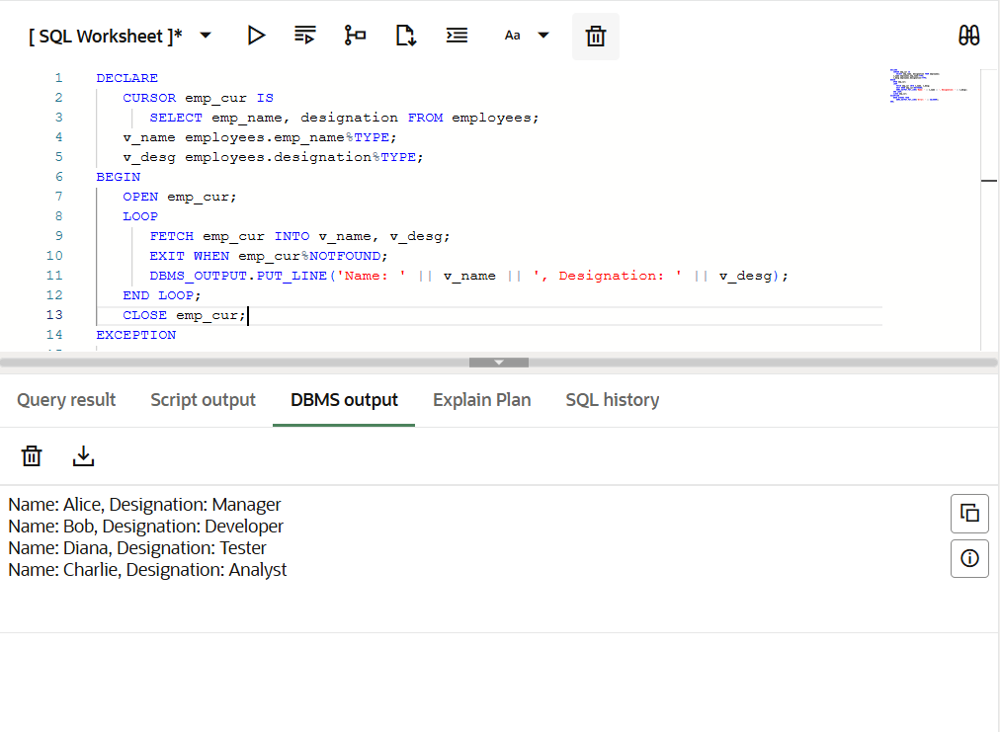
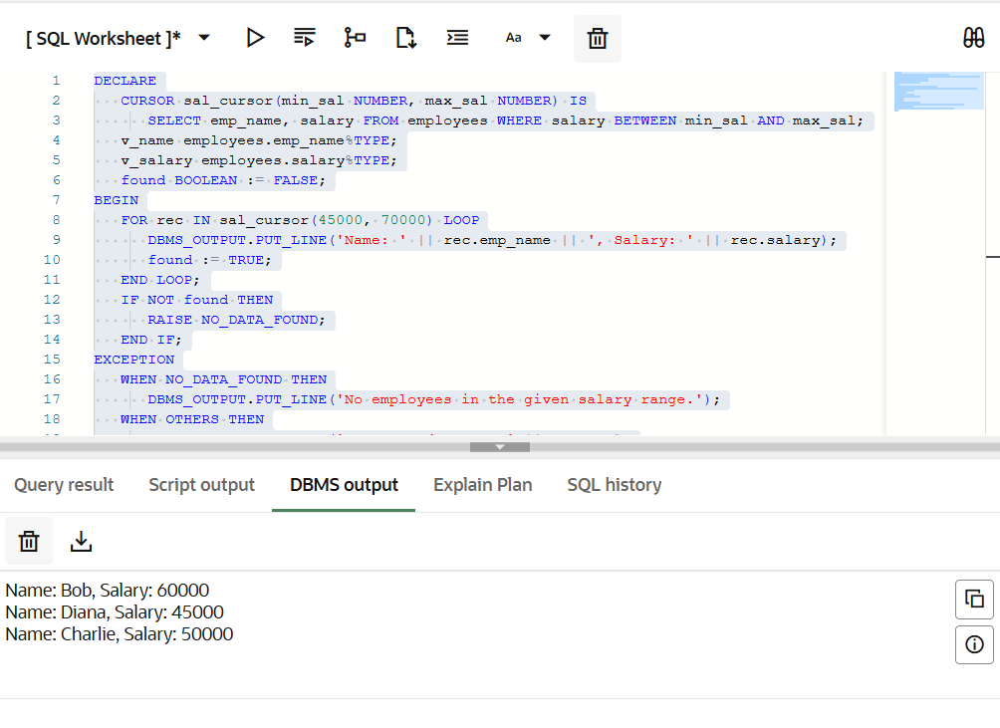
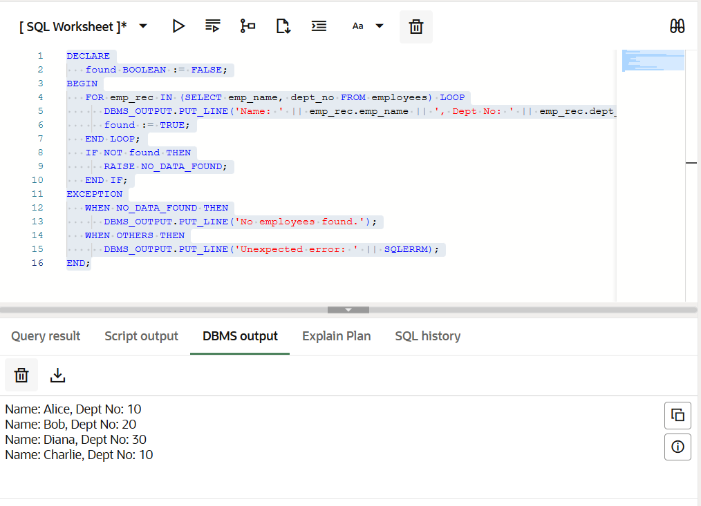
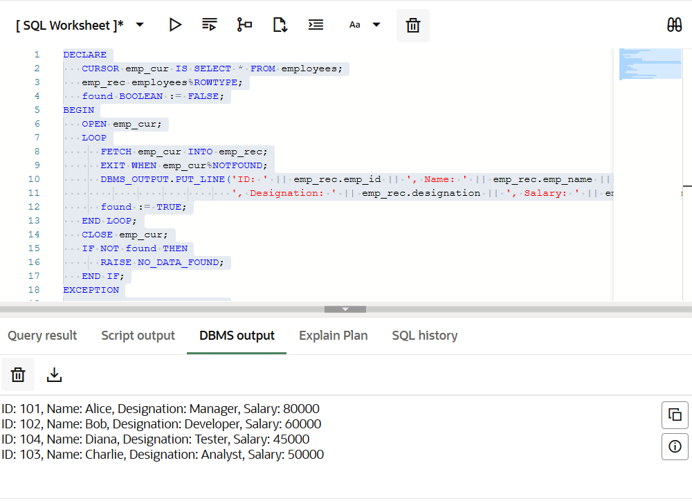
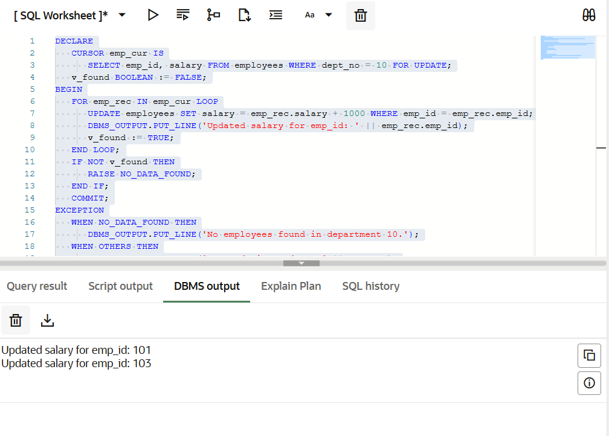

# Experiment 8: PL/SQL Cursor Programs

## AIM
To write and execute PL/SQL programs using cursors and exception handling to manage runtime errors effectively and display appropriate messages.

## THEORY

In PL/SQL, cursors are used to handle query result sets row-by-row. 

There are two types of cursors:

- Implicit Cursors: Automatically created by PL/SQL for single-row queries.
- Explicit Cursors: Declared and controlled by the programmer for multi-row queries.

Types of Explicit Cursors:

1. Simple Cursor: Basic cursor to iterate over multiple rows.

2. Parameterized Cursor: Accepts parameters to filter the result dynamically.

3. Cursor FOR Loop: Simplifies cursor operations (open, fetch, close).

4. %ROWTYPE Cursor: Fetches entire row into a record using %ROWTYPE.

5. Cursor with FOR UPDATE: Used for row-level locking and updating the rows while looping.

**Syntax:**
```sql
DECLARE 
   <declarations section> 
BEGIN 
   <executable command(s)>
EXCEPTION 
   <exception handling> 
END;
```

### Basic Components of PL/SQL Block:

- DECLARE: Section to declare variables and constants.
- BEGIN: The execution section that contains PL/SQL statements.
- EXCEPTION: Handles errors or exceptions that occur in the program.
- END: Marks the end of the PL/SQL block.

**Exception Handling**

PL/SQL provides a robust mechanism to handle runtime errors using exception handling blocks. When an error occurs during execution, control is passed to the EXCEPTION section, where specific or general errors can be handled gracefully.

### Components of Exception Handling:
- Predefined Exceptions: Automatically raised by PL/SQL for common errors (e.g., NO_DATA_FOUND, TOO_MANY_ROWS, ZERO_DIVIDE).
- User-defined Exceptions: Declared explicitly in the declaration section using the EXCEPTION keyword.
- WHEN OTHERS: A generic handler for all exceptions not handled explicitly.

```sql
BEGIN
   -- Statements
EXCEPTION
   WHEN exception_name THEN
      -- Handling code
   WHEN OTHERS THEN
      -- Handling for unknown errors
END;
```

### **Question 1: Simple Cursor with Exception Handling**

**Write a PL/SQL program using a simple cursor to fetch employee names and designations from the `employees` table. Implement exception handling for the following cases:**

1. **NO_DATA_FOUND**: When no rows are fetched.
2. **OTHERS**: Any other unexpected errors during execution.

**Steps:**

- Create an `employees` table with fields `emp_id`, `emp_name`, and `designation`.
- Insert some sample data into the table.
- Use a simple cursor to fetch and display employee names and designations.
- Implement exception handling to catch the relevant exceptions and display appropriate messages.

#### Program:
```
DECLARE
   CURSOR emp_cur IS
      SELECT emp_name, designation FROM employees;
   v_name employees.emp_name%TYPE;
   v_desg employees.designation%TYPE;
BEGIN
   OPEN emp_cur;
   LOOP
      FETCH emp_cur INTO v_name, v_desg;
      EXIT WHEN emp_cur%NOTFOUND;
      DBMS_OUTPUT.PUT_LINE('Name: ' || v_name || ', Designation: ' || v_desg);
   END LOOP;
   CLOSE emp_cur;
EXCEPTION
   WHEN OTHERS THEN
      DBMS_OUTPUT.PUT_LINE('Error: ' || SQLERRM);
END;
```

**Output:**  
The program should display the employee details or an error message.



---

### **Question 2: Parameterized Cursor with Exception Handling**

**Write a PL/SQL program using a parameterized cursor to retrieve and display employees with a salary in a given range. Implement exception handling for the following errors:**

1. **NO_DATA_FOUND**: When no employees meet the salary criteria.
2. **OTHERS**: For any unexpected errors during the execution.

**Steps:**

- Modify the `employees` table by adding a `salary` column.
- Insert sample salary values for the employees.
- Use a parameterized cursor to accept a salary range as input and fetch employees within that range.
- Implement exception handling to catch and display relevant error messages.

#### Program:
```
DECLARE
   CURSOR sal_cursor(min_sal NUMBER, max_sal NUMBER) IS
      SELECT emp_name, salary FROM employees WHERE salary BETWEEN min_sal AND max_sal;
   v_name employees.emp_name%TYPE;
   v_salary employees.salary%TYPE;
   found BOOLEAN := FALSE;
BEGIN
   FOR rec IN sal_cursor(45000, 70000) LOOP
      DBMS_OUTPUT.PUT_LINE('Name: ' || rec.emp_name || ', Salary: ' || rec.salary);
      found := TRUE;
   END LOOP;
   IF NOT found THEN
      RAISE NO_DATA_FOUND;
   END IF;
EXCEPTION
   WHEN NO_DATA_FOUND THEN
      DBMS_OUTPUT.PUT_LINE('No employees in the given salary range.');
   WHEN OTHERS THEN
      DBMS_OUTPUT.PUT_LINE('Unexpected error: ' || SQLERRM);
END;
```

**Output:**  
The program should display the employee details within the specified salary range or an error message if no data is found.



---

### **Question 3: Cursor FOR Loop with Exception Handling**

**Write a PL/SQL program using a cursor FOR loop to retrieve and display all employee names and their department numbers from the `employees` table. Implement exception handling for the following cases:**

1. **NO_DATA_FOUND**: If no employees are found in the database.
2. **OTHERS**: For any other unexpected errors.

**Steps:**

- Modify the `employees` table by adding a `dept_no` column.
- Insert sample department numbers for employees.
- Use a cursor FOR loop to fetch and display employee names along with their department numbers.
- Implement exception handling to catch the relevant exceptions.

#### Program:
```
DECLARE
   found BOOLEAN := FALSE;
BEGIN
   FOR emp_rec IN (SELECT emp_name, dept_no FROM employees) LOOP
      DBMS_OUTPUT.PUT_LINE('Name: ' || emp_rec.emp_name || ', Dept No: ' || emp_rec.dept_no);
      found := TRUE;
   END LOOP;
   IF NOT found THEN
      RAISE NO_DATA_FOUND;
   END IF;
EXCEPTION
   WHEN NO_DATA_FOUND THEN
      DBMS_OUTPUT.PUT_LINE('No employees found.');
   WHEN OTHERS THEN
      DBMS_OUTPUT.PUT_LINE('Unexpected error: ' || SQLERRM);
END;
```

**Output:**  
The program should display employee names with their department numbers or the appropriate error message if no data is found.



---

### **Question 4: Cursor with `%ROWTYPE` and Exception Handling**

**Write a PL/SQL program that uses a cursor with `%ROWTYPE` to fetch and display complete employee records (emp_id, emp_name, designation, salary). Implement exception handling for the following errors:**

1. **NO_DATA_FOUND**: When no employees are found in the database.
2. **OTHERS**: For any other errors that occur.

**Steps:**

- Modify the `employees` table by adding `emp_id`, `emp_name`, `designation`, and `salary` fields.
- Insert sample data into the `employees` table.
- Declare a cursor using `%ROWTYPE` to fetch complete rows from the `employees` table.
- Implement exception handling to catch the relevant exceptions and display appropriate messages.

#### Program:
```
DECLARE
   CURSOR emp_cur IS SELECT * FROM employees;
   emp_rec employees%ROWTYPE;
   found BOOLEAN := FALSE;
BEGIN
   OPEN emp_cur;
   LOOP
      FETCH emp_cur INTO emp_rec;
      EXIT WHEN emp_cur%NOTFOUND;
      DBMS_OUTPUT.PUT_LINE('ID: ' || emp_rec.emp_id || ', Name: ' || emp_rec.emp_name ||
                           ', Designation: ' || emp_rec.designation || ', Salary: ' || emp_rec.salary);
      found := TRUE;
   END LOOP;
   CLOSE emp_cur;
   IF NOT found THEN
      RAISE NO_DATA_FOUND;
   END IF;
EXCEPTION
   WHEN NO_DATA_FOUND THEN
      DBMS_OUTPUT.PUT_LINE('No employee data found.');
   WHEN OTHERS THEN
      DBMS_OUTPUT.PUT_LINE('Error: ' || SQLERRM);
END;
```

**Output:**  
The program should display employee records or the appropriate error message if no data is found.



---

### **Question 5: Cursor with FOR UPDATE Clause and Exception Handling**

**Write a PL/SQL program using a cursor with the `FOR UPDATE` clause to update the salary of employees in a specific department. Implement exception handling for the following cases:**

1. **NO_DATA_FOUND**: If no rows are affected by the update.
2. **OTHERS**: For any unexpected errors during execution.

**Steps:**

- Modify the `employees` table to include a `dept_no` and `salary` field.
- Insert sample data into the `employees` table with different department numbers.
- Use a cursor with the `FOR UPDATE` clause to lock the rows of employees in a specific department and update their salary.
- Implement exception handling to handle `NO_DATA_FOUND` or other errors that may occur.

#### Program:
```
DECLARE
   CURSOR emp_cur IS
      SELECT emp_id, salary FROM employees WHERE dept_no = 10 FOR UPDATE;
   v_found BOOLEAN := FALSE;
BEGIN
   FOR emp_rec IN emp_cur LOOP
      UPDATE employees SET salary = emp_rec.salary + 1000 WHERE emp_id = emp_rec.emp_id;
      DBMS_OUTPUT.PUT_LINE('Updated salary for emp_id: ' || emp_rec.emp_id);
      v_found := TRUE;
   END LOOP;
   IF NOT v_found THEN
      RAISE NO_DATA_FOUND;
   END IF;
   COMMIT;
EXCEPTION
   WHEN NO_DATA_FOUND THEN
      DBMS_OUTPUT.PUT_LINE('No employees found in department 10.');
   WHEN OTHERS THEN
      DBMS_OUTPUT.PUT_LINE('Error during update: ' || SQLERRM);
END;
```

**Output:**  
The program should update employee salaries and display a message, or it should display an error message if no data is found.



---

## RESULT
Thus, the program successfully executed and displayed employee details using a cursor. 

